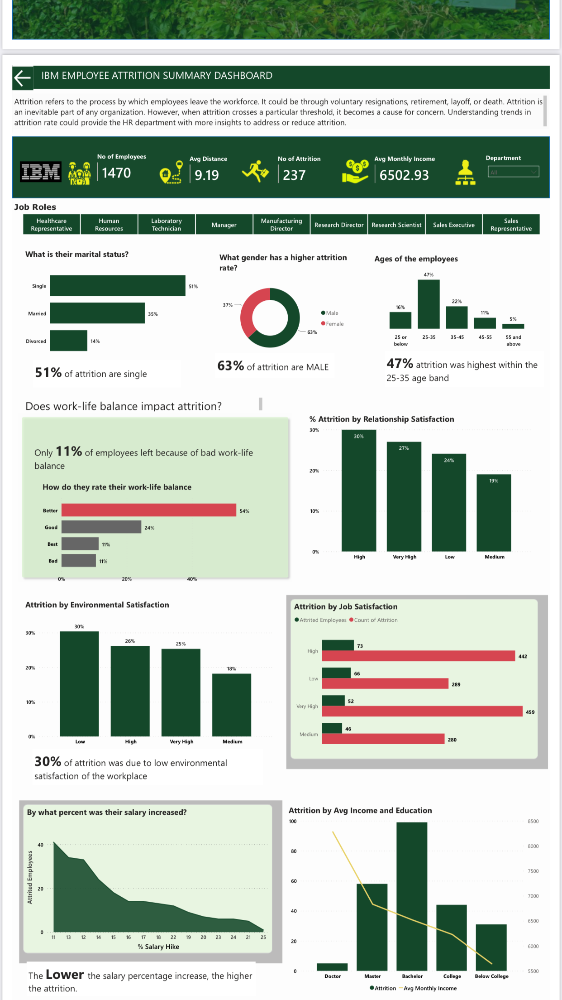
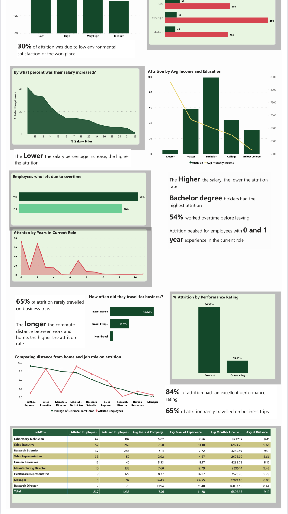

# Ibm_Employee_Attrition_Visualization

## Introduction
This is an analysis of a fictional dataset created by IBM scientists. 

## Problem Statement
1. Uncover the factors that lead to employee attrition and explore important questions such as;
- What important factors can lead to an employee leaving the organization.
- How do we improve employee retention.
- Predict indivedual employee retention 

## Insight Hint
A. Education
1 Below College
2 College
3 Bachelor
4 Master
5 Doctor

B. Environment Satisfaction
1 Low
2 Medium
3 High
4 Very High

C. Job Satisfaction
1 Low
2 Medium
3 High
4 Very High

D. Relationship Satifaction
1 Low
2 Medium
3 High
4 Very High

E. WorkLife Balance
1 Bad
2 Good
3 Better
4 Best

F. Job Involvement
1 Low
2 Medium
3 High
4 Very High

G. Performance Rating
1 Low
2 Good
3 Excellent
4 Outstanding

## Visualization
You can interact with the report [here](ibm_employee_attrition.pbix)

## Analysis
1. I tranformed the data with the insights provided
2. I proceeded to create new measures using DAX

- Number of attrition= CALCULATE(DISTINCTCOUNT('IBM HR Analytics Employee Attrition & Performance'[EmployeeNumber]),
                        FILTER('IBM HR Analytics Employee Attrition & Performance', 'IBM HR Analytics Employee Attrition & Performance'[Attrition] = "Yes"))

- Attrition by Job Role = CALCULATE(DISTINCTCOUNT('IBM HR Analytics Employee Attrition & Performance'[JobRole]), 
FILTER('IBM HR Analytics Employee Attrition & Performance','IBM HR Analytics Employee Attrition & Performance'[Attrition]="Yes"))

- Married Men Leaving= CALCULATE(DISTINCTCOUNT('IBM HR Analytics Employee Attrition & Performance'[EmployeeNumber]),
FILTER('IBM HR Analytics Employee Attrition & Performance', 'IBM HR Analytics Employee Attrition & Performance'[Gender] = "Male"),
FILTER('IBM HR Analytics Employee Attrition & Performance', 'IBM HR Analytics Employee Attrition & Performance'[Attrition] = "Yes"),
FILTER('IBM HR Analytics Employee Attrition & Performance', 'IBM HR Analytics Employee Attrition & Performance'[MaritalStatus] = "Married"))

3. Created a conditional column called 'Age Bin' to group the ages into
- <25 
- 25-35
-35-45
- 45-55
- Above 55

4. I created the dashboard and adjusted the size of the report.

