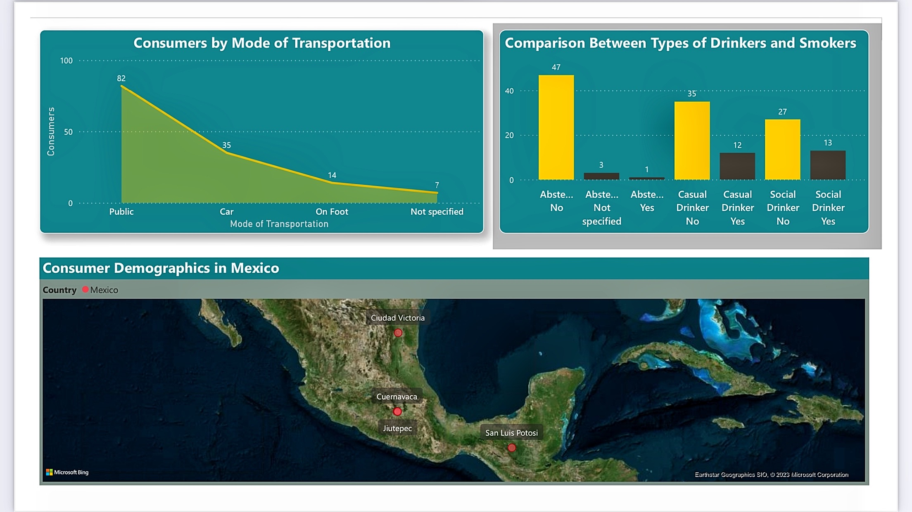

# Restaurant-Analysis

## Introduction
This is a Power Bi project on the consumer analysis and ratings of some Mexican restaurants by real consumers from 2012. It includes additional information about each restaurant and their cuisines, and each consumer and their preferences.

## Problem Statement
1. What can you learn from the highest rated restaurants? Do consumer preferences have an effect on ratings?
The top overall rated restaurants had their prices falling in the medium price category.
3. What are the consumer demographics? Does this indicate a bias in the data sample?
4. Are there any demand & supply gaps that you can exploit in the market?
5. If you were to invest in a restaurant, which characteristics would you be looking for?

## Visualization
You can interact with the report [here](https://github.com/lisa-nga/Restaurant-Analysis/blob/main/Restaurant%20rating%20pbi.pbix)
Page 1                        |       Page 2
:---------------------------: | :---------------------:
        |       

## Analysis
1. What can you learn from the highest rated restaurants? Do consumer preferences have an effect on ratings?
- 12 out of 130 restaurants have an overall rating between 18 to 36.
Consumer preferences can definitely have an effect on ratings. Customers will rate restaurants based on their personal experiences, which can be influenced by factors such as their taste preferences, the type of cuisine they enjoy, and their expectations for a dining experience.

- For example, a customer who prefers spicier food may rate a Mexican restaurant higher if the dishes they tried were spicy. On the other hand, a customer who prefers milder food may rate the same restaurant lower for the same reason.

2. What are the consumer demographics? Does this indicate a bias in the data sample?

- Only 3 cities were sampled out of 134 cities in Mexico. They are Cuidad Victoria, San Luis Potosi, and Cuernavaca. The population is not a true representative of the total population of consumers.

3. Are there any demand & supply gaps that you can exploit in the market?
   
**Supply gaps:**

- Location: It is not clear from the information provided if there are enough Mexican restaurants in the area to meet the demand of the consumers who prefer Mexican food. If there are not enough Mexican restaurants in the area, this could be a supply gap.

- Price range: While 66% of consumers have a medium budget, only 4% have a high budget. This could indicate that there is a lack of Mexican restaurants that offer higher-end dining options, which could be a supply gap.

- Transportation: The fact that 82 people use public transport and only 35 have personal cars could suggest that there is a supply gap for Mexican restaurants that are easily accessible by public transportation.

**Demand gaps:**

- Variety: While 97 out of 138 consumers prefer Mexican food, it is not clear if there is demand for a variety of Mexican cuisine, such as regional specialties or vegetarian/vegan options. If there is demand for these options and they are not available, this could be a demand gap.

- Atmosphere: The fact that 82% of consumers are students could suggest that there is demand for a casual, laid-back atmosphere in Mexican restaurants. If there are not enough restaurants that cater to this demand, this could be a demand gap.

- Delivery Service: With a high proportion of students population, restaurants could set up an app or website to order their favourite meals from the comfort of their apartments.

- Special events: It is not clear from the information provided if there is demand for Mexican restaurants to host special events, such as birthday parties or corporate events. If there is demand for these services and they are not being provided, this could be a demand gap.

- Quality: There may be a demand for restaurants that focus on quality and authentic Mexican cuisine.
Price: Most of the restaurants with the highest ratings are medium priced. There may be a gap in the market for more affordable Mexican restaurants that still offer good quality food.

- Cuisine: If there are few restaurants in the area that specialize in a particular type of Mexican cuisine (e.g. street food, regional specialties), there may be a demand for restaurants that focus on these types of dishes.

4. If you were to invest in a restaurant, which characteristics would you be looking for?
Consider:

- Location: Should be easily accessible, has good road traffic, and is in an area with a high demand for Mexican cuisine.
- Quality: Restaurants with a focus on quality ingredients and authentic Mexican cuisines. Consider factors such as the restaurant's use of fresh ingredients, the quality of its meats and seafood, and the authenticity of its recipes.
- Reputation: Restaurants that have positive reviews.
- Quality of service.
